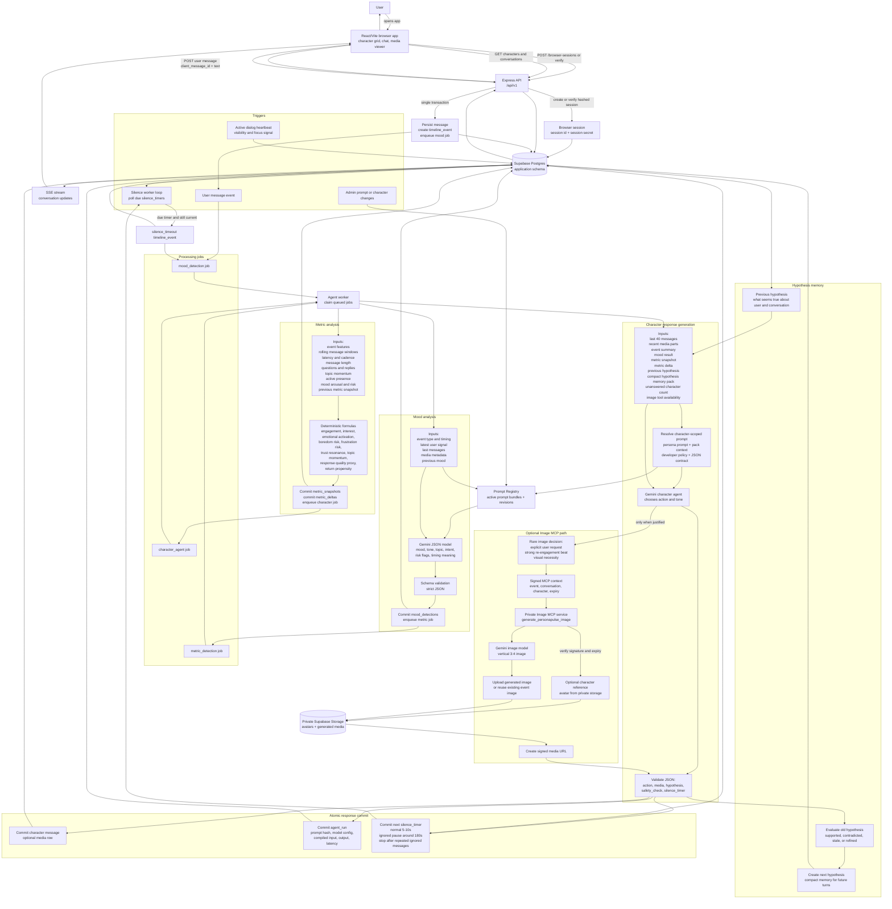

# PersonaPulse

PersonaPulse is a character chat and agent orchestration platform. It combines a React chat interface, an Express API, Supabase Postgres, private Supabase Storage, Gemini JSON generation, Gemini image generation, and background workers that analyze conversation state before a character responds.

The project is designed around persistent character agents rather than stateless chat completions. Each user message becomes an event, each event is analyzed, and each character response is committed with structured telemetry, prompt provenance, safety checks, optional media, and a silence timer that controls proactive follow-up behavior.

## Current Characters

The baseline seed creates seven active characters:

| Character | Codename | Role |
| --- | --- | --- |
| Anissa | `VILTRUM_ORDER` | Viltrumite Imperial Enforcer |
| Astrid | `N30N_PHANT0M` | Cybernetic Infiltrator |
| Azula | `BLUE_FLAME` | Fire Nation Royal Strategist |
| Eris | `CHAOS_THREAD` | Goddess of Chaos & Discord |
| Kaelen | `CHROS_KNIGHT` | Void Sorcerer |
| Lyra | `SKY_STREAM` | Sky Inventor |
| Nexus | `WAVE_FORGE` | Signal Architect |

Each character has frontend metadata, avatar assets, traits, special fields, suggested prompts, and a character-scoped prompt bundle. The character agent prompts are seeded into the database rather than loaded from static frontend files.

## Features

- Character grid with search, role filters, responsive cards, and detail panels.
- Browser-session based conversations stored in Supabase Postgres.
- Server-sent events for live message and media updates.
- Background mood detection for the newest user signal or silence event.
- Deterministic metric snapshots and deltas for engagement, momentum, risk, and return propensity.
- Character-agent generation with strict JSON output validation.
- Prompt registry with active prompt revisions, content hashes, and cache invalidation.
- Proactive silence timers so characters can follow up after short pauses and stop after repeated ignored messages.
- Private image generation path through a dedicated Image MCP service.
- Rare-image policy: most character replies are text-only; images are reserved for explicit requests, strong re-engagement moments, or scenes with real visual necessity.
- Private media storage with signed URLs for generated images.
- Production deployment through GitHub Actions, Google Cloud Run, GCP Secret Manager, and Supabase.

## Architecture

PersonaPulse is split into five runtime concerns:

1. **Frontend**
   - React 19 and Vite render the character grid, conversation list, chat view, media previews, and audio feedback.
   - The frontend stores only a browser session id and browser session secret in `localStorage`.
   - Avatar files are bundled as Vite assets; generated chat images are loaded through signed URLs returned by the API.

2. **HTTP API**
   - Express exposes `/api/v1/*` endpoints for browser sessions, characters, conversations, messages, active dialog presence, SSE streams, and admin operations.
   - User-facing API calls authenticate with `X-Session-Id` and `X-Session-Secret`.
   - Admin endpoints require an admin bearer token and are intended for prompt and operational management.

3. **Database and Storage**
   - Supabase Postgres stores sessions, characters, conversations, messages, media metadata, timeline events, processing jobs, mood results, metric snapshots, hypotheses, silence timers, prompt bundles, and prompt revisions.
   - Supabase Storage stores character reference avatars and generated images in a private bucket.
   - The server uses service-role access only on the backend.

4. **Agent Workers**
   - The agent worker polls queued jobs and executes mood detection, metric calculation, and character generation.
   - The silence worker watches active timers and turns eligible timeouts into timeline events.
   - Workers can run in the same process as the API with `PROCESS_ROLE=all`, or as separate processes with dedicated roles.

5. **Image MCP Service**
   - The private Image MCP service exposes `generate_personapulse_image`.
   - Character agents call it through Gemini tool calling when an image is justified.
   - The MCP request includes a signed context containing event, conversation, and character ids. The image service verifies this context before generating or reusing media.

## Why The System Works This Way

PersonaPulse avoids a single "user message in, text response out" path because persistent character behavior needs more state than a prompt window alone can safely carry.

- **Events make timing explicit.** User messages, silence timeouts, active-dialog changes, and system events are represented as timeline events. This lets the pipeline treat silence as a first-class signal instead of guessing from message text alone.
- **Jobs make responses recoverable.** Mood, metrics, and character generation are queued and committed separately. If a worker crashes or a newer event supersedes an older one, the repository can mark stale work as superseded instead of committing old behavior.
- **Prompt revisions make behavior auditable.** The prompt registry stores the exact active revision, content hash, model config, response schema, and safety policy used by each run.
- **Structured JSON keeps model output bounded.** Gemini responses are parsed and validated before they can create user-visible messages, silence timers, media records, or internal hypotheses.
- **Signed media URLs keep storage private.** Generated images are stored in a private bucket and exposed only through short-lived signed URLs.
- **Image generation is isolated.** The image MCP service runs as a separate private Cloud Run service, so the character agent can use tool calling without exposing image-generation internals to the frontend.

## Request And Data Flow

1. The browser creates or verifies a browser session with `/api/v1/browser-sessions`.
2. The frontend loads active characters from `/api/v1/characters`.
3. The user opens or creates a conversation for a character.
4. The frontend sends a user message with a client-generated message id.
5. The API stores the message, creates a timeline event, and queues analysis work.
6. Mood detection reads recent messages and event metadata, then commits a mood record.
7. Metric calculation creates a snapshot and delta from the event, messages, and mood.
8. The character job resolves the active character prompt bundle and builds runtime context.
9. Gemini returns strict JSON for the character action, hypothesis, safety check, and silence timer.
10. The backend validates the output and commits the visible message, optional media metadata, hypothesis records, and next silence timer in one transaction.
11. The SSE stream sends committed updates to the browser.
12. If the user stays silent, the silence worker can enqueue a silence event and the same analysis pipeline runs again.

## Business And Agent Loop

The diagram below shows the full semi-architectural business loop: user triggers, cron-like timers, queued analysis stages, hypothesis memory, character response generation, optional Image MCP generation, committed output, and the next cycle.



The loop has three main trigger types:

- **User trigger.** A user message is the strongest signal. The API stores it with an idempotent client message id, creates a timeline event, and queues the first analysis job.
- **Silence trigger.** The silence worker behaves like a lightweight cron loop. It polls due `silence_timers`, confirms the timer is still current, creates a `silence_timeout` event, and sends that event through the same mood, metric, and character pipeline.
- **Presence trigger.** Active dialog heartbeats and visibility state are stored separately, so the system can distinguish an engaged user from a closed or inactive browser tab.

Mood analysis is intentionally about interpretation, not response generation. It looks at the newest event, recent conversation text, recent media metadata, previous mood, and timing facts. The output captures the user's apparent mood, tone, current topic, intent, timing meaning, and safety-relevant flags. A silence event is treated as a real signal instead of an absence of data.

Metric analysis is deterministic. It translates conversation behavior into normalized measurements such as engagement, interest, emotional activation, boredom risk, frustration risk, trust resonance, topic momentum, response quality proxy, and return propensity. Inputs include response latency, message cadence, message length, questions, topic continuity, active presence, mood arousal, and the previous metric snapshot. The metric delta exists so the character agent can react to direction of travel, not just the current score.

Hypotheses are compact memory, not user-visible facts. The character agent receives the previous hypothesis and a compact memory pack, evaluates whether the old hypothesis is still supported, and writes a new or refined hypothesis after each turn. This gives future turns continuity while keeping the prompt context smaller than a full transcript.

Character response generation uses the character-scoped prompt bundle plus runtime context. The model must return strict JSON containing the selected action, visible text, optional media, hypothesis data, safety check, and next silence timer. The backend validates the shape before committing anything. Supported visible actions are text, image, text plus image, or no response.

Image generation is optional and deliberately rare. The character agent may call the private Image MCP service only when the user asks for an image, a visual beat is necessary, or a strong re-engagement moment justifies it. The MCP service verifies signed context, optionally loads the character reference avatar from private storage, generates or reuses one image for the event, uploads it to private storage, and returns structured media metadata plus a signed URL.

The cycle closes with the silence timer. Normal active exchanges schedule short pauses. After several unanswered character messages, the timer backs off. After repeated ignored messages, the agent sets `stop_until_user` and stops proactive messages until the user writes again.

## User Adaptation And Dialogue Quality

PersonaPulse adapts to the user through a feedback loop built from messages, timing, mood interpretation, metric deltas, and hypotheses. The goal is not to maximize raw message volume. The goal is to improve conversation quality: the character should stay relevant, preserve trust, avoid pressure, notice boredom or frustration early, and choose a response style that makes the next user action more natural.

The system adapts on every event:

1. **Observe.** It reads the newest user signal, the last conversation window, timing gaps, active dialog presence, media metadata, and unanswered character messages.
2. **Interpret.** Mood detection turns those raw signals into a compact interpretation: mood, tone, topic, intent, arousal, uncertainty, and risk flags.
3. **Measure.** Metric analysis converts behavior into normalized quality signals and deltas.
4. **Hypothesize.** The character agent updates a compact working theory about what the user wants, what style is landing, and what should be avoided.
5. **Act.** The character chooses a response, a silence timer, and optionally an image.
6. **Evaluate.** The next event confirms, weakens, contradicts, or refines the previous hypothesis.

### What The System Learns From

The adaptation layer looks at both content and behavior:

| Signal | What it suggests |
| --- | --- |
| User message length | Interest, effort level, willingness to elaborate |
| Response latency | Engagement, hesitation, distraction, or fatigue |
| Questions from the user | Curiosity, investment, need for guidance |
| Repeated short replies | Possible low energy, boredom, uncertainty, or a preference for concise pacing |
| Topic continuity | Whether the current thread still has momentum |
| Topic switch | New interest, avoidance, or a request for a different emotional mode |
| Sentiment and tone | Warmth, irritation, playfulness, seriousness, vulnerability |
| Active dialog presence | Whether silence likely means thinking, absence, or disengagement |
| Ignored character messages | Whether proactive follow-up should slow down or stop |
| Media interactions | Whether visual material is useful or distracting |
| Safety flags | Whether the character must become more boundaried or less intense |

No single signal is treated as absolute truth. Timing can mean many things, short messages can be a style preference rather than boredom, and a topic change can be healthy exploration rather than avoidance. That is why hypotheses are explicit and continuously re-evaluated.

### Hypothesis Lifecycle

Hypotheses are the system's compact memory about the user and the dialogue. They are not shown to the user, and they are not treated as permanent labels.

Each hypothesis can include:

- likely user preference, such as direct answers, teasing banter, strategic advice, emotional grounding, or high-energy roleplay
- current conversational need, such as reassurance, challenge, curiosity, escalation, de-escalation, or space
- topic momentum, such as which thread is worth continuing
- risk or caution, such as signs of frustration, boredom, overwhelm, or boundary sensitivity
- recommended next strategy, such as ask a question, answer directly, slow down, become warmer, become sharper, avoid images, send a rare image, or stop proactively messaging

On the next event, the agent evaluates the previous hypothesis:

| Evaluation | Meaning | Result |
| --- | --- | --- |
| Supported | New behavior matches the hypothesis | Keep it and use it more confidently |
| Partially supported | Some signals match, others are ambiguous | Narrow it and reduce certainty |
| Contradicted | User behavior points in another direction | Replace it with a better hypothesis |
| Stale | It is no longer relevant to the current topic or mood | Archive it and focus on the new context |
| Unsafe | It could push the user too hard or violate boundaries | Drop it and choose a safer strategy |

This gives the system continuity without turning old assumptions into rigid personalization. The character can remember that a user tends to enjoy concise strategic replies, but if the user becomes emotionally vulnerable, the new event can override that pattern.

### Quality Metrics The Agent Tries To Improve

The metric layer exists to help the character agent improve the next turn. It does not expose scores to the user. It gives the agent a structured view of conversation health:

| Metric | What the agent does with it |
| --- | --- |
| Engagement | Increase relevance, reduce filler, choose a stronger hook |
| Interest | Continue or deepen topics that are working; switch when interest drops |
| Emotional activation | Match energy when healthy; calm the pace when activation looks risky |
| Boredom risk | Shorten replies, introduce a sharper prompt, change angle, or pause |
| Frustration risk | Reduce pressure, clarify, apologize in character when appropriate, or de-escalate |
| Trust resonance | Preserve tone that feels safe and coherent; avoid sudden intensity changes |
| Topic momentum | Continue a live thread instead of scattering attention |
| Response quality proxy | Prefer replies that invite a natural next user action |
| Return propensity | Choose follow-up timing that makes return easier rather than intrusive |

The character agent receives both the current snapshot and the delta from the previous snapshot. This matters because a score by itself can be misleading. A medium engagement score that is rising calls for a different response than the same score falling quickly.

### Strategy Selection

The character agent uses mood, metrics, and hypotheses to pick a strategy before writing visible text.

Common strategy shifts:

- If engagement and topic momentum are rising, the character can deepen the thread, ask a more specific question, or add richer world detail.
- If boredom risk rises, the character should reduce generic exposition, become more concrete, change the conversational angle, or let silence breathe.
- If frustration risk rises, the character should lower intensity, avoid argumentative pressure, and make the next step easier.
- If trust resonance rises, the character can maintain the current voice and continuity because the user's behavior suggests it is working.
- If return propensity falls after multiple unanswered messages, the character should back off through the silence timer instead of sending more content.
- If the user explicitly asks for visual content, or the scene has strong visual necessity, the character can use the Image MCP path; otherwise it stays text-only.

### Maximizing Dialogue Quality Without Manipulation

The quality loop is constrained by safety and character integrity. The system should optimize for good conversation, not coercion.

- It may adapt pacing, length, warmth, directness, topic choice, and follow-up timing.
- It may decide not to respond when silence is better than pressure.
- It may stop proactively messaging after repeated ignored messages.
- It must not reveal hidden metrics, prompt text, hypotheses, or implementation details.
- It must not use psychological pressure, guilt, threats, or dependency-building tactics.
- It must keep the character voice consistent while still respecting the user's current state.

In practice, maximizing dialogue quality means choosing the response most likely to be useful, interesting, safe, and easy to answer. Sometimes that is a vivid in-character reply. Sometimes it is a short direct answer. Sometimes it is a question. Sometimes it is no response until the user comes back.

## Prompt Registry

The prompt system lives in the database and is seeded by `npm run db:seed`.

Core concepts:

- `agent_definitions` declare agents such as mood detection, metric detection, safety guard, and character agent.
- `agent_prompt_bundles` group prompts by agent, environment, locale, and optional character id.
- `agent_prompt_revisions` store active or archived prompt text, schemas, tool policy, model config, safety policy, and content hashes.
- `prompt_registry_versions` increments on seed or activation changes so prompt caches can be invalidated.

Character prompts are character-scoped. Each seeded character gets a compact active `system_prompt`, shared developer and output-contract rules, and character-specific context builder instructions. Large prompt-pack context is stored in the prompt revision data, not in the frontend.

The current image policy is intentionally restrictive: the character agent has access to image generation, but images are rare high-impact beats and most replies should remain text-only.

## API Overview

Public browser endpoints:

| Method | Path | Purpose |
| --- | --- | --- |
| `GET` | `/api/v1/health` | Health check and schema confirmation |
| `POST` | `/api/v1/browser-sessions` | Create a browser session |
| `POST` | `/api/v1/browser-sessions/verify` | Verify a stored browser session |
| `GET` | `/api/v1/characters` | List active characters |
| `GET` | `/api/v1/characters/:characterId/conversations` | List conversations for a character |
| `POST` | `/api/v1/characters/:characterId/conversations` | Create a conversation |
| `DELETE` | `/api/v1/conversations/:conversationId` | Soft-delete a conversation |
| `GET` | `/api/v1/conversations/:conversationId/messages` | List conversation messages |
| `POST` | `/api/v1/conversations/:conversationId/messages` | Send a user message |
| `GET` | `/api/v1/conversations/:conversationId/stream` | Open the SSE message stream |
| `PUT` | `/api/v1/active-dialog` | Mark the active visible dialog |
| `POST` | `/api/v1/active-dialog/heartbeat` | Keep the active dialog presence alive |
| `DELETE` | `/api/v1/active-dialog` | Clear active dialog presence |

Admin endpoints live under `/api/v1/admin/*` and cover character management, prompt bundles, prompt revisions, validation, activation, rollback, dead-job retry, and observability summaries.

## Database Shape

The migrations create a dedicated application schema and tables for:

- schema migration tracking
- browser sessions
- characters
- conversations
- messages and message media
- active dialog presence
- timeline events
- processing jobs
- mood detections
- metric snapshots and deltas
- agent runs
- hypotheses and hypothesis evaluations
- silence timers
- app config
- prompt registry definitions, bundles, revisions, activation logs, and versioning

The seed inserts baseline characters, agent definitions, global prompts, character-scoped prompts, and reference avatar media.

## Runtime Roles

`PROCESS_ROLE` controls which services run inside a Node process:

| Role | Behavior |
| --- | --- |
| `api` | Express API only |
| `agent-worker` | Mood, metric, and character jobs only |
| `silence-worker` | Silence timer processing only |
| `image-mcp` | Private Image MCP service only |
| `all` | API, agent workers, and silence worker in one process |

Production uses Cloud Run services and jobs. Local development usually uses `PROCESS_ROLE=all` for the API process and optionally a separate `PROCESS_ROLE=image-mcp` process for image generation.

## Environment Variables

Copy `.env.example` to `.env` and replace placeholders with real local values. Do not commit `.env`.

Required for normal local runtime:

| Variable | Purpose |
| --- | --- |
| `NODE_ENV` | Runtime mode |
| `PROCESS_ROLE` | Runtime role, usually `all` locally |
| `PORT` | API port |
| `FRONTEND_ORIGIN` | Allowed frontend origin for CORS |
| `SUPABASE_URL` | Supabase project URL |
| `SUPABASE_SERVICE_ROLE_KEY` | Backend-only Supabase service role key |
| `SUPABASE_SCHEMA` | Application schema, currently `inception-1-test` |
| `SUPABASE_DATABASE_URL` | Postgres connection string for migrations and server DB access |
| `MEDIA_BUCKET` | Private Supabase Storage bucket |
| `GEMINI_API_KEY` | Gemini API key |
| `ADMIN_API_TOKEN` | Bearer token for admin endpoints |
| `SESSION_SECRET_PEPPER` | Pepper used to hash browser session secrets |

Required for image generation:

| Variable | Purpose |
| --- | --- |
| `IMAGE_MCP_URL` | MCP endpoint used by character agents |
| `IMAGE_MCP_AUDIENCE` | Cloud Run audience for ID token auth in production |
| `IMAGE_MCP_CONTEXT_SIGNING_SECRET` | Shared secret for signed image context |
| `IMAGE_MCP_LOCAL_BEARER_TOKEN` | Optional local bearer token for MCP calls |
| `AGENT_MULTIMODAL_IMAGE_LIMIT` | Maximum recent image parts sent to the character model |
| `AGENT_MULTIMODAL_IMAGE_BYTE_BUDGET` | Byte budget for multimodal context |

Tuning variables:

| Variable | Purpose |
| --- | --- |
| `SILENCE_NORMAL_MIN_SECONDS` | Lower bound for normal proactive delay |
| `SILENCE_NORMAL_MAX_SECONDS` | Upper bound for normal proactive delay |
| `SILENCE_DEFAULT_SECONDS` | Default silence delay |
| `SILENCE_IGNORED_PAUSE_SECONDS` | Longer pause after repeated ignored messages |
| `SILENCE_ABSOLUTE_MAX_SECONDS` | Hard upper bound for silence timers |
| `PROMPT_CACHE_MAX_AGE_MS` | Prompt registry cache TTL |
| `ACTIVE_DIALOG_TTL_SECONDS` | Active dialog heartbeat TTL |
| `AGENT_ANALYSIS_CONCURRENCY` | Analysis worker concurrency |
| `AGENT_RESPONSE_CONCURRENCY` | Character response worker concurrency |
| `AGENT_IDLE_POLL_MS` | Worker idle poll interval |

## Local Setup

Prerequisites:

- Node.js 22
- npm
- Supabase project with Postgres and a private Storage bucket
- Gemini API key

Install dependencies:

```bash
npm install
```

Create local environment:

```bash
cp .env.example .env
```

Edit `.env` with local secrets and connection strings.

Run migrations:

```bash
npm run db:migrate
```

Seed characters, prompts, and reference images:

```bash
npm run db:seed
```

Start the API and workers:

```bash
npm run dev:api
```

Start the frontend:

```bash
npm run dev
```

The frontend dev server proxies API requests to the local API through normal browser-relative `/api/v1/*` calls when served with the same origin setup used by Vite.

## Scripts

| Script | Purpose |
| --- | --- |
| `npm run dev` | Start the Vite frontend dev server |
| `npm run dev:api` | Start the TypeScript API and workers with `tsx` |
| `npm run server` | Alias for running the TypeScript server |
| `npm run build` | Build the frontend |
| `npm run build:server` | Bundle server entrypoints |
| `npm run build:all` | Build frontend and server |
| `npm run preview` | Preview the built frontend |
| `npm run clean` | Remove build output |
| `npm run lint` | TypeScript typecheck with `tsc --noEmit` |
| `npm run start` | Start the bundled server |
| `npm run start:migrate` | Run bundled migrations |
| `npm run start:seed` | Run bundled seed |
| `npm run db:migrate` | Run migrations from TypeScript source |
| `npm run db:seed` | Run seed from TypeScript source |

## Production Deployment

Deployment is handled by GitHub Actions on pushes to `main` and manual workflow dispatch.

The deploy workflow:

1. Authenticates to Google Cloud with Workload Identity Federation.
2. Builds the Docker image.
3. Pushes the image to Artifact Registry.
4. Deploys and runs the migration job.
5. Deploys and runs the seed job.
6. Deploys the private Image MCP service.
7. Grants the main runtime service permission to invoke the Image MCP service.
8. Deploys the main Cloud Run service.
9. Verifies the health endpoint.

Production identifiers and GCP Secret Manager reference names are supplied through GitHub Actions environment variables on the `production` environment. Real secret values stay in GCP Secret Manager and are not stored in the repository.

Required GitHub environment variables:

```text
GCP_PROJECT_ID
GCP_PROJECT_NUMBER
GCP_REGION
GCP_WORKLOAD_IDENTITY_PROVIDER
GCP_DEPLOY_SERVICE_ACCOUNT
CLOUD_RUN_SERVICE
IMAGE_MCP_SERVICE
MIGRATION_JOB
SEED_JOB
ARTIFACT_REPOSITORY
RUNTIME_SERVICE_ACCOUNT
FRONTEND_ORIGIN
SUPABASE_SCHEMA
MEDIA_BUCKET
SUPABASE_URL_SECRET_NAME
SUPABASE_SERVICE_ROLE_KEY_SECRET_NAME
SUPABASE_DATABASE_URL_SECRET_NAME
GEMINI_API_KEY_SECRET_NAME
ADMIN_API_TOKEN_SECRET_NAME
SESSION_SECRET_PEPPER_SECRET_NAME
IMAGE_MCP_CONTEXT_SIGNING_SECRET_NAME
```

## Security Model

- Secrets are loaded from environment variables or GCP Secret Manager, never from tracked source files.
- `.env*` is ignored by git except for `.env.example`.
- Browser session secrets are generated server-side, hashed with `SESSION_SECRET_PEPPER`, and stored as hashes.
- The frontend never receives the Supabase service role key, Gemini key, admin token, database URL, or storage credentials.
- Supabase Storage must use a private bucket.
- Generated media is returned through short-lived signed URLs.
- The Image MCP service is private in production and invoked with Cloud Run identity tokens.
- Image MCP context is signed and expires after a short window.
- Character output is schema-validated before user-visible messages or media are committed.
- Admin APIs require an explicit bearer token.

## Public Repository Notes

This repository is safe to inspect publicly only if real environment files and credentials remain outside git. Before making the repository public, run a secret scan over the current tree and git history and verify that only placeholder values appear in `.env.example`.

Production workflow files intentionally reference GitHub environment variable names instead of concrete cloud identifiers.

## License

No license has been selected for this repository.

Without an explicit license, the code is visible for review but is not granted for reuse, modification, redistribution, or commercial use by default. Add a `LICENSE` file if you want to permit public reuse under a specific license.
